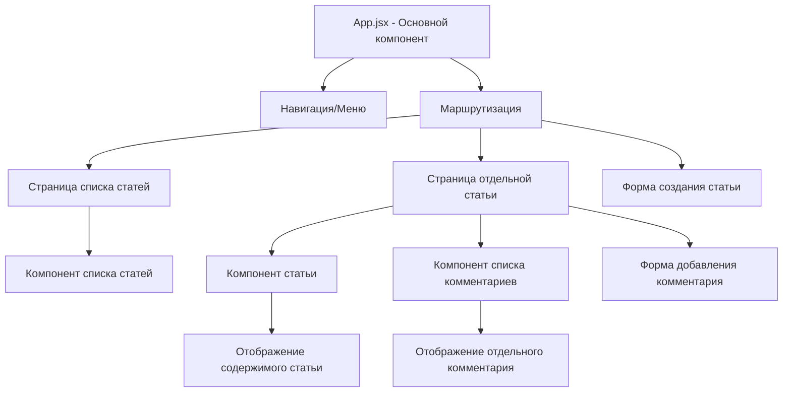
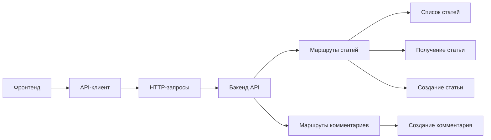

# Архитектура фронтенда блога

## Структура компонентов и страниц



## Взаимодействие с API



## Структура данных

### Статья (Article)
- id: number
- title: string
- content: string
- created_at: string (формат: Y-m-d H:i:s)
- comments: Comment[]

### Комментарий (Comment)
- id: number
- article_id: number
- author_name: string
- content: string
- created_at: string

## Файловая структура

```
web/src/
├── components/
│   ├── ArticleList.jsx
│   ├── Article.jsx
│   ├── CommentList.jsx
│   ├── Comment.jsx
│   ├── Navigation.jsx
│   ├── ArticleForm.jsx
│   └── CommentForm.jsx
├── pages/
│   ├── ArticleListPage.jsx
│   ├── ArticlePage.jsx
│   └── CreateArticlePage.jsx
├── api/
│   └── client.js
├── App.jsx
├── main.jsx
├── index.css
└── App.css